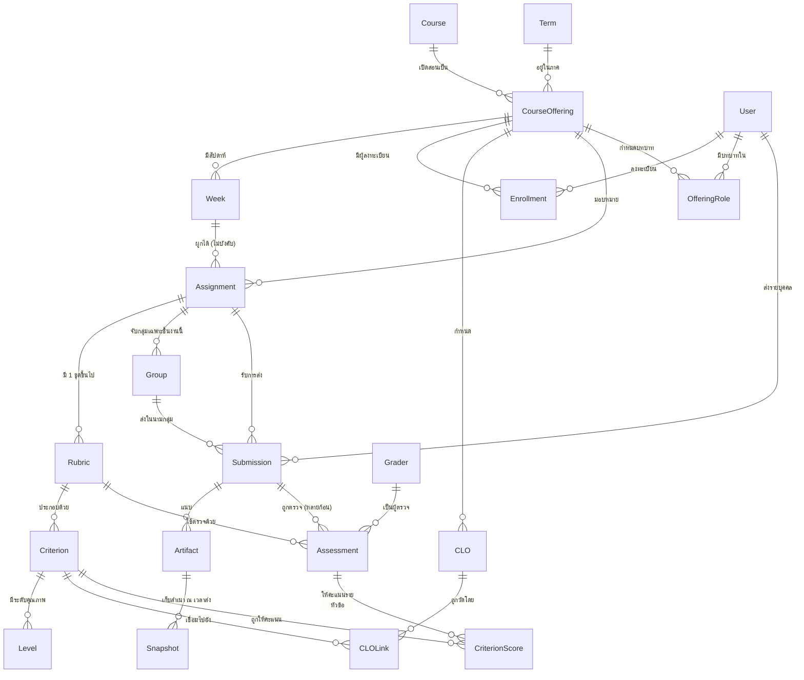

# CONTEXT — ศัพท์กลางและ domain model ของระบบ AI ช่วยตรวจงาน

เอกสารนี้คือ **ภาษากลาง** ของโครงงาน ทุก ticket, ทุก wireframe, ทุกชื่อตารางในฐานข้อมูล และทุกข้อความบนหน้าจอ ต้องใช้คำตามเอกสารนี้ ถ้าจะเปลี่ยนคำ ให้แก้ที่นี่ที่เดียวแล้วไล่แก้ตาม

สถานะ: ตัดสินแล้ว 5 ประเด็นหลัก (ดู "การตัดสินใจที่ยืนยันแล้ว") ส่วนที่เหลือเป็นนิยามที่เสนอไว้ตามมาตรฐาน ยังไม่ได้ยืนยันกับอาจารย์

---

## หลักภาษา

**ไทยเป็นหลัก ทับศัพท์เฉพาะคำเทคนิคที่จำเป็น** — คำที่แปลแล้วสื่อสารได้ดีให้ใช้ไทย ส่วนคำที่วงการศึกษาใช้ทับศัพท์อยู่แล้ว (Rubric, CLO) คงไว้ เพราะการแปลจะทำให้สื่อสารกับอาจารย์ท่านอื่นยากขึ้น

| ใช้คำนี้ | ไม่ใช้ | เหตุผล |
|---|---|---|
| รายวิชา | วิชา (ลอย ๆ) | "วิชา" กำกวมระหว่าง Course กับ Course Offering |
| การเปิดสอน | เซคชั่น, กลุ่มเรียน | "กลุ่ม" ถูกจองไว้ให้กลุ่มส่งงานแล้ว |
| ชิ้นงาน | งาน, การบ้าน | "งาน" กำกวมกับงานของระบบ (job/task) |
| การส่ง | ไฟล์งาน | แยกเหตุการณ์การส่งออกจากไฟล์ที่แนบมา |
| การตรวจ | การให้คะแนน (ลอย ๆ) | "การให้คะแนน" ไม่บอกว่าเป็นเหตุการณ์ที่มีผู้ตรวจกำกับ |
| Rubric | เกณฑ์ (ลอย ๆ) | "เกณฑ์" ชนกับหัวข้อประเมินที่อยู่ข้างใน Rubric |
| หัวข้อประเมิน | เกณฑ์ย่อย | สั้นกว่าและไม่ชนกับ Rubric |
| CLO | ผลลัพธ์การเรียนรู้ (ลอย ๆ) | ต้องแยกจาก PLO และเป็นคำที่ใช้ในเอกสาร มคอ. อยู่แล้ว |

---

## การตัดสินใจที่ยืนยันแล้ว (จาก ticket 08)

### 1. แยก รายวิชา (Course) ออกจาก การเปิดสอน (Course Offering)

- **รายวิชา (Course)** = แม่แบบในหลักสูตร มีรหัสวิชา ชื่อ คำอธิบายรายวิชา หน่วยกิต — ไม่มีนักศึกษา ไม่มีคะแนน
- **การเปิดสอน (Course Offering)** = การสอนรายวิชาหนึ่งในภาคการศึกษาหนึ่ง เช่น "UX/UI Design ภาค 1/2569"

**CLO, Rubric, ตารางสัปดาห์, ชิ้นงาน, รายชื่อนักศึกษา และคะแนนทั้งหมด ผูกกับการเปิดสอน ไม่ใช่รายวิชา**

เหตุผล: คะแนนของแต่ละเทอมจึงปิดตัวเองได้สมบูรณ์ ปรับ Rubric เทอมนี้ไม่กระทบคะแนนเทอมก่อน และเทอมใหม่ "คัดลอกจากการเปิดสอนครั้งก่อน" ได้ทั้งชุด (CLO + สัปดาห์ + ชิ้นงาน + Rubric) แล้วแก้เฉพาะที่ต้องการ

### 2. สัปดาห์ (Week) เป็น entity จริงของการเปิดสอน

- เมื่อเปิดการสอน ระบบสร้างสัปดาห์ที่ 1–16 (จำนวนปรับได้) แต่ละสัปดาห์มีหัวข้อและช่วงวันที่
- **ชิ้นงานจะผูกกับสัปดาห์หรือไม่ก็ได้** — ตอบโจทย์ข้อ 4 ที่ว่า "ไม่จำเป็นต้องมีทุกสัปดาห์"
- สัปดาห์ที่ไม่มีชิ้นงานก็ยังมีตัวตน (มีหัวข้อบรรยาย)

เหตุผล: ได้หน้าจอ "ตารางทั้งเทอม" ที่อาจารย์เห็นภาพรวมได้ และคัดลอกข้ามเทอมได้ทั้งโครง

### 3. การส่งซ้ำเก็บทุกเวอร์ชัน

- ทุกครั้งที่นักศึกษากดส่ง เกิด **การส่ง (Submission)** ระเบียนใหม่ ไม่ทับของเดิม
- การส่งล่าสุดคือฉบับที่ใช้งาน (active) ของเก่ายังอยู่ครบ
- **คะแนนชี้ไปที่การส่งเวอร์ชันที่ถูกตรวจจริง** ไม่ใช่ชี้ไปที่ชิ้นงานลอย ๆ

เหตุผล: ตอบโจทย์ข้อ 9 (trace ได้ว่าคะแนนมาจากไหน) และจำเป็นเป็นพิเศษกับ Figma เพราะนักศึกษาแก้ไฟล์ต่อได้ตลอดโดยลิงก์ไม่เปลี่ยน — ถ้าไม่เก็บเวอร์ชัน ระบบจะตอบไม่ได้ว่า AI ตรวจจากอะไร
ผลพลอยได้: ได้ข้อมูลวิจัยว่านักศึกษาแก้งานกี่รอบและดีขึ้นอย่างไร

> ข้อกำหนดที่ตามมา (ส่งต่อไป ticket 17): ตอนกดส่ง ระบบต้อง **snapshot** ภาพและข้อมูลจาก Figma เก็บไว้ทันที ลิงก์อย่างเดียวไม่พอ

### 4. การตรวจ (Assessment) — หนึ่งก้อนต่อผู้ตรวจหนึ่งราย

**การตรวจ** = เหตุการณ์ที่ผู้ตรวจหนึ่งราย (AI หรือคน) ให้คะแนนการส่งหนึ่งครั้ง ด้วย Rubric หนึ่งชุด

- AI ตรวจ = การตรวจ 1 ก้อน
- อาจารย์ตรวจซ้ำ = การตรวจอีก 1 ก้อน **แยกจากกัน ไม่เขียนทับ**
- ก้อนของอาจารย์ถูกทำเครื่องหมายเป็น **คำตัดสิน (authoritative)** — คือคะแนนที่นักศึกษาเห็นและใช้ตัดเกรด
- ก้อนของ AI ยังอยู่ครบตลอดไป

เหตุผล: **ส่วนต่างระหว่างคะแนน AI กับคะแนนอาจารย์คือสัญญาณเรียนรู้ทั้งหมด** ที่โจทย์ข้อ 8 และข้อ 13 ต้องใช้ ถ้าเขียนทับกันในก้อนเดียว ส่วนต่างจะหายไปตลอดกาลและวัดความสอดคล้องไม่ได้เลย
ผลพลอยได้: รองรับ double-marking (อาจารย์สองคนตรวจงานเดียวกันเพื่อวัด inter-rater reliability), รองรับ TA ตรวจ, และรองรับการให้ AI หลายโมเดลตรวจงานเดียวกันเพื่อเปรียบเทียบ — โดยไม่ต้องแก้โครงสร้างทีหลัง

### 5. คำศัพท์บนหน้าจอ — ไทยเป็นหลัก ทับศัพท์เท่าที่จำเป็น

ดูตารางในหัวข้อ "หลักภาษา" ด้านบน

---

## อภิธานศัพท์

### โครงเรื่องรายวิชา

| คำ | นิยาม |
|---|---|
| **รายวิชา (Course)** | แม่แบบในหลักสูตร: รหัส ชื่อ คำอธิบาย หน่วยกิต ไม่มีนักศึกษา ไม่มีคะแนน |
| **การเปิดสอน (Course Offering)** | รายวิชาหนึ่ง สอนในภาคการศึกษาหนึ่ง เป็นเจ้าของ CLO / สัปดาห์ / ชิ้นงาน / Rubric / รายชื่อ / คะแนน ทั้งหมด |
| **ภาคการศึกษา (Term)** | เช่น "1/2569" มีปีการศึกษา เลขภาค วันเปิด-ปิดภาค — เป็น entity ของตัวเอง ไม่ใช่ข้อความลอย เพื่อให้กรองและเรียงลำดับได้ |
| **การลงทะเบียน (Enrollment)** | ความสัมพันธ์ นักศึกษา ↔ การเปิดสอน มีสถานะ (ลงทะเบียน / ถอน) นักศึกษาเรียนซ้ำ = การลงทะเบียนใหม่ในการเปิดสอนคนละครั้ง คะแนนไม่ปน |
| **สัปดาห์ (Week)** | หน่วยเวลาของการเปิดสอน มีลำดับ หัวข้อ ช่วงวันที่ ชิ้นงานผูกกับสัปดาห์ได้แต่ไม่บังคับ |

### งานและการส่ง

| คำ | นิยาม |
|---|---|
| **ชิ้นงาน (Assignment)** | สิ่งที่อาจารย์มอบหมาย มีคำสั่ง กำหนดส่ง รูปแบบการส่ง (เดี่ยว/กลุ่ม) และ Rubric อย่างน้อยหนึ่งชุด |
| **การส่ง (Submission)** | เหตุการณ์ที่นักศึกษาหรือกลุ่มส่งงานหนึ่งครั้ง มีเวลาส่ง ผู้ส่ง และสถานะส่งช้า/ตรงเวลา ส่งใหม่ = ระเบียนใหม่ |
| **ไฟล์แนบ (Artifact)** | สิ่งที่แนบมากับการส่ง: ลิงก์ Figma, ไฟล์อัปโหลด, ข้อความ — หนึ่งการส่งมีได้หลายไฟล์แนบ |
| **สแนปช็อต (Snapshot)** | สำเนาภาพ/ข้อมูลของไฟล์แนบ ณ เวลาที่ส่ง เก็บไว้เพื่อให้ตรวจสอบย้อนหลังได้แม้ต้นฉบับถูกแก้ |
| **กลุ่ม (Group)** | กลุ่มผู้ส่งของ **ชิ้นงานหนึ่งชิ้น** ไม่ใช่ของรายวิชา — ชิ้นงานคนละชิ้นจับกลุ่มคนละแบบได้ (โจทย์ข้อ 6) รายละเอียดอยู่ที่ ticket 11 |
| **สถานะส่งช้า (Late)** | เป็น **สถานะ** ของการส่ง ไม่ใช่การหักคะแนนอัตโนมัติ — การหักคะแนนเป็นการตัดสินใจของอาจารย์ ต้องเห็นชัดว่าหักเพราะอะไร (ยังไม่ยืนยัน) |

### เกณฑ์และคะแนน

| คำ | นิยาม |
|---|---|
| **Rubric** | ชุดเกณฑ์การให้คะแนน **หนึ่งมิติ** ของชิ้นงานหนึ่ง ชิ้นงานหนึ่งมีได้หลาย rubric (เช่น ด้านงานออกแบบ + ด้านการนำเสนอ) แต่ละตัวมีคะแนนเต็มของตัวเอง — **ไม่ใช่** การให้ผู้ตรวจต่างคนใช้คนละชุด (ticket 10) |
| **เวอร์ชันของ rubric (RubricVersion)** | เนื้อหาจริงของ rubric ณ ช่วงเวลาหนึ่ง **เวอร์ชันที่ใช้ตรวจไปแล้วแก้ไม่ได้ตลอดไป** ทุกคะแนนอ้างเวอร์ชันที่ใช้ตรวจจริง (ticket 10) |
| **แม่แบบ rubric (Template)** | rubric ที่เก็บไว้ในคลังระดับ**รายวิชา** เพื่อหยิบไปใช้ข้ามเทอม **หยิบ = ก๊อป** แก้ในชิ้นงานไม่กระทบแม่แบบ และแก้แม่แบบไม่ไหลกลับ (ticket 10) |
| **หัวข้อประเมิน (Criterion)** | หนึ่งแง่มุมที่ถูกให้คะแนน เช่น "ความสม่ำเสมอของ visual hierarchy" มีน้ำหนักและระดับคุณภาพ **และเป็นจุดที่เชื่อมกับ CLO** |
| **ระดับคุณภาพ (Level)** | คำบรรยายว่าคะแนนแต่ละระดับหน้าตาเป็นอย่างไร เช่น 4 = ดีเยี่ยม พร้อมคำอธิบายที่ทำให้ AI และคนตัดสินตรงกัน |
| **น้ำหนัก (Weight)** | สัดส่วนของหัวข้อประเมินในคะแนนรวมของชิ้นงาน |
| **การตรวจ (Assessment)** | ผู้ตรวจหนึ่งราย + การส่งหนึ่งครั้ง + Rubric หนึ่งชุด = หนึ่งก้อน (ดูการตัดสินใจข้อ 4) |
| **ผู้ตรวจ (Grader)** | AI หรือคน — ถ้าเป็น AI ต้องบันทึกรุ่นโมเดลและเวอร์ชัน prompt ไว้ด้วย |
| **คะแนนรายหัวข้อ (Criterion Score)** | หน่วยที่เล็กที่สุดที่ระบบเก็บ: การตรวจหนึ่งก้อน × หัวข้อประเมินหนึ่งหัวข้อ พร้อมเหตุผลและหลักฐานที่อ้างอิง (รายละเอียดอยู่ที่ ticket 12) |
| **คะแนนชิ้นงาน** | ผลรวมถ่วงน้ำหนักของคะแนนรายหัวข้อจากการตรวจที่เป็นคำตัดสิน |
| **คำตัดสิน (Authoritative)** | เครื่องหมายบนการตรวจที่ระบุว่าก้อนนี้คือคะแนนที่มีผลจริง |
| **การปรับคะแนนรายบุคคล (Individual Adjustment)** | รายการที่อาจารย์ปรับคะแนนของสมาชิกกลุ่มคนหนึ่งให้ต่างจากคะแนนกลุ่ม บันทึกเป็นส่วนต่างพร้อมเหตุผลบังคับ **วางทับคะแนนกลุ่ม ไม่เขียนทับ** (ticket 11) |
| **คะแนนสุทธิ** | คะแนนกลุ่ม + ผลรวมการปรับรายบุคคล — คำนวณเสมอ ไม่เก็บเป็นค่านิ่ง |

### ผลลัพธ์การเรียนรู้

| คำ | นิยาม |
|---|---|
| **CLO** | ผลลัพธ์การเรียนรู้ของรายวิชา **เป็นของการเปิดสอน** — เทอมใหม่คัดลอกมาแก้ได้โดยไม่กระทบของเดิม |
| **การเชื่อม CLO** | ความสัมพันธ์ระหว่าง **หัวข้อประเมิน** กับ CLO พร้อมน้ำหนัก — เชื่อมที่ระดับหัวข้อประเมิน ไม่ใช่ระดับชิ้นงาน (รายละเอียดอยู่ที่ ticket 13) |
| **ระดับการบรรลุ CLO (Attainment)** | คำนวณได้สองระดับ: ของนักศึกษารายคน และของทั้งชั้น สูตรอยู่ที่ ticket 13 |

### คน

| คำ | นิยาม |
|---|---|
| **ผู้ใช้ (User)** | บัญชีหนึ่งบัญชีต่อคนหนึ่งคน |
| **บทบาท (Role)** | อาจารย์ / ผู้ช่วยสอน / นักศึกษา / ผู้ดูแลระบบ — **บทบาทผูกกับการเปิดสอน ไม่ใช่กับบัญชี** คนเดียวจึงเป็นอาจารย์ในวิชาหนึ่งและนักศึกษาในอีกวิชาได้ (รายละเอียดอยู่ที่ ticket 18) |

---

## แผนภาพความสัมพันธ์

จุดที่ต้องอ่านให้ชัดในแผนภาพนี้:

1. **Submission → Assessment เป็นแบบหนึ่งต่อหลาย** — งานหนึ่งชิ้นถูกตรวจได้หลายก้อน (AI, อาจารย์, TA, อาจารย์คนที่สอง)
2. **CriterionScore แขวนอยู่ใต้ Assessment ไม่ใช่ใต้ Submission** — คะแนนทุกตัวจึงรู้เสมอว่าใครให้ ตรวจจากเวอร์ชันไหน ด้วย Rubric ชุดไหน
3. **Criterion เชื่อมกับ CLO ไม่ใช่ Assignment เชื่อมกับ CLO** — คะแนนจึงไหลกลับสู่ CLO ได้ละเอียดตามโจทย์ข้อ 10
4. **Group แขวนใต้ Assignment ไม่ใช่ใต้ CourseOffering** — ตอบโจทย์ข้อ 6 โดยตรง

---

## คำที่จงใจไม่ใช้

| คำต้องห้าม | เพราะ | ใช้แทนด้วย |
|---|---|---|
| วิชา (ลอย ๆ) | กำกวมระหว่าง Course กับ Course Offering — ต้นเหตุความสับสนอันดับหนึ่งของระบบแบบนี้ | รายวิชา / การเปิดสอน |
| Class | อังกฤษหมายได้ทั้งคาบเรียน ชั้นเรียน และการเปิดสอน | การเปิดสอน / คาบเรียน |
| เกณฑ์ (ลอย ๆ) | ชนกันเองระหว่าง Rubric กับ Criterion | Rubric / หัวข้อประเมิน |
| การให้คะแนน (ลอย ๆ) | ไม่บอกว่าเป็นเหตุการณ์หรือเป็นตัวเลข | การตรวจ (เหตุการณ์) / คะแนน (ตัวเลข) |
| งาน (ลอย ๆ) | ชนกับ background job ของระบบ | ชิ้นงาน / การส่ง |
| กลุ่ม (ในบริบทรายวิชา) | ถูกจองไว้ให้กลุ่มส่งงานแล้ว | การเปิดสอน |
| ทีม | คำพ้องของกลุ่มโดยไม่จำเป็น ทำให้โค้ดมีสองคำเรียกของเดียวกัน | กลุ่ม |
| Grade | ปนกันระหว่างเกรด A-F กับคะแนนดิบ | คะแนน / เกรด (เฉพาะ A-F) |
| Feedback (ลอย ๆ) | ปนกันระหว่างเหตุผลที่ AI อธิบายคะแนน กับข้อเสนอแนะที่เขียนถึงนักศึกษา | เหตุผลประกอบคะแนน / ข้อเสนอแนะถึงนักศึกษา |

---

## ประเด็นที่ยังไม่ยืนยัน (ส่งต่อไป ticket อื่น)

- โครงสร้างภายในและการทำเวอร์ชันของ Rubric → ticket 10
- ความหมายของ "ชิ้นงานหนึ่งมี Rubric ได้มากกว่าหนึ่งชุด" → ticket 10
- กฎการกระจายคะแนนกลุ่มลงรายบุคคล และกรณีขอบของกลุ่ม → ticket 11
- ฟิลด์ provenance ทั้งหมดของ CriterionScore → ticket 12
- สูตรคำนวณ CLO attainment → ticket 13
- นโยบายการหักคะแนนงานส่งช้า → ยังไม่มี ticket (บันทึกไว้ที่ Not yet specified)
