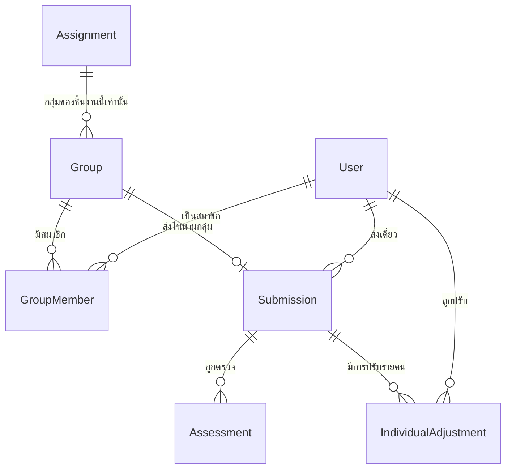

# 11 — โมเดลการส่งงานกลุ่ม และการแปลงคะแนนกลุ่มเป็นคะแนนรายบุคคล

Type: grilling
Status: resolved
Blocked by: 08

## Question

เมื่อกลุ่มเปลี่ยนได้ทุกครั้งที่ส่ง กลุ่มถูกสร้างขึ้นอย่างไร ใครสร้าง และคะแนนที่ให้กับ "งานหนึ่งชิ้นของกลุ่ม" กลายเป็นคะแนนของนักศึกษาแต่ละคนได้อย่างไร?

โจทย์ข้อ 6 กับข้อ 9 ชนกันตรง ๆ: ข้อ 6 บอกว่าส่งเป็นกลุ่มได้และกลุ่มไม่คงที่ ส่วนข้อ 9 บอกว่าคะแนนต้องเก็บรายบุคคลและ trace ได้ว่ามาจากไหน — จุดเชื่อมระหว่างสองข้อนี้คือกฎการกระจายคะแนน ซึ่งต้องตัดสินให้ชัดก่อนออกแบบอะไรต่อ

## สิ่งที่ต้องตัดสิน

1. **ใครสร้างกลุ่ม** — นักศึกษาจับกลุ่มกันเองแล้วคนหนึ่งสร้างและเชิญเพื่อน / อาจารย์จัดกลุ่มให้ / ระบบสุ่มให้ — และรองรับกี่แบบ
2. **ช่วงเวลาที่แก้กลุ่มได้** — แก้ได้จนถึงเมื่อไร (ก่อนกำหนดส่ง? ก่อนส่งจริง?); หลังส่งแล้วแก้ได้ไหม; หลังตรวจแล้วล่ะ
3. **กรณีขอบที่ต้องตอบให้ได้**
   - นักศึกษาคนหนึ่งไม่ได้อยู่ในกลุ่มไหนเลยตอนหมดเวลาส่ง — เกิดอะไรขึ้น
   - นักศึกษาอยู่สองกลุ่มพร้อมกันในงานชิ้นเดียว — ระบบต้องกันไว้หรือปล่อย
   - กลุ่มมีสมาชิก 3 คน แต่ส่งงานแค่คนเดียวแล้วอีกสองคนไม่รู้เรื่อง
   - นักศึกษาถอนรายวิชากลางเทอม แต่ชื่อยังอยู่ในกลุ่มของงานที่ตรวจไปแล้ว
   - งานชิ้นเดียวกันบางกลุ่มส่งเดี่ยว บางกลุ่มส่งเป็นทีม — อนุญาตไหม
4. **กฎการกระจายคะแนนจากกลุ่มสู่บุคคล** — เลือกกฎหลักและกฎที่รองรับเพิ่ม
   - ทุกคนในกลุ่มได้คะแนนเท่ากัน (ง่ายที่สุด และน่าจะเป็นค่าเริ่มต้น)
   - อาจารย์ปรับคะแนนรายคนได้หลังจากได้คะแนนกลุ่มแล้ว (ต้องมีเหตุผลบันทึกไว้ไหม)
   - มีการประเมินการมีส่วนร่วมโดยเพื่อนร่วมกลุ่ม (peer evaluation) เป็นตัวคูณ — ถ้าเอาด้วยจะกลายเป็นฟีเจอร์ใหญ่อีกก้อน ต้องชั่งน้ำหนักกับเวลาที่มี
5. **ขนาดกลุ่ม** — กำหนดต่ำสุด/สูงสุดต่อชิ้นงานได้ไหม ระบบบังคับหรือแค่เตือน
6. **สิ่งที่ นศ. แต่ละคนเห็น** — สมาชิกกลุ่มทุกคนเห็นงานที่ส่ง เห็นคะแนน เห็นเหตุผลที่ AI ให้ ครบเท่ากันไหม; ถ้าอาจารย์ปรับคะแนนรายคนไม่เท่ากัน เพื่อนในกลุ่มเห็นคะแนนของกันและกันไหม

## สิ่งที่ต้องได้เมื่อจบ ticket

- โครงสร้างข้อมูลของกลุ่มที่ผูกกับชิ้นงาน (ไม่ใช่ผูกกับรายวิชา) และสมาชิกกลุ่ม
- กฎการกระจายคะแนนที่เขียนเป็นประโยคชัดเจน พร้อมกฎสำรองเมื่ออาจารย์ต้องการปรับรายคน
- คำตอบของกรณีขอบทุกข้อข้างต้น — ข้อไหนระบบต้องกัน ข้อไหนแค่เตือน ข้อไหนปล่อยผ่าน

## Answer

### กลุ่มเกิดขึ้นตอนไหนและใครสร้าง

**นักศึกษาสร้างเองตอนกดส่ง** — คนที่กดส่งเลือกเพื่อนร่วมกลุ่มจากรายชื่อผู้ลงทะเบียนในการเปิดสอนนั้น กลุ่มเกิดขึ้นพร้อมการส่งในจังหวะเดียว ไม่มีขั้นตอน "สร้างกลุ่ม" แยกต่างหาก
**อาจารย์แก้ได้ตลอด** และเห็นเสมอว่าใครเป็นคนสร้างกลุ่ม

เหตุผล: ตรงกับเจตนาของโจทย์ข้อ 6 ที่กลุ่มไม่คงที่ และไม่โยนงานธุรการจับกลุ่ม 6 รอบต่อเทอมให้อาจารย์

**เมื่อถูกเพิ่มเข้ากลุ่ม สมาชิกคนอื่นต้องรู้ทันที** — หน้าชิ้นงานของแต่ละคนขึ้นว่า "คุณอยู่ในกลุ่มกับ ... สร้างโดย ..." และออกจากกลุ่มเองได้จนถึงกำหนดส่ง ไม่ต้องกดอนุมัติ (จะฝืดเกินไปและงานค้างเพราะเพื่อนไม่กดอนุมัติ) แต่ต้องเห็น

### การกระจายคะแนน — สองชั้นวางทับกัน

**ชั้นที่ 1 คะแนนกลุ่ม** — ผลการตรวจของงานชิ้นนั้น ทุกคนในกลุ่มได้เท่ากันโดยอัตโนมัติ
**ชั้นที่ 2 การปรับคะแนนรายบุคคล (Individual Adjustment)** — รายการแยกที่วางทับ ไม่เขียนทับ

| ฟิลด์ของการปรับ | บังคับ |
|---|---|
| นักศึกษาที่ถูกปรับ | ✓ |
| การส่งที่เกี่ยวข้อง | ✓ |
| ค่าที่ปรับ (ระบุเป็นส่วนต่าง เช่น −4) | ✓ |
| เหตุผล | ✓ |
| ผู้ปรับและเวลา | ✓ |

**คะแนนสุทธิ = คะแนนกลุ่ม + ผลรวมการปรับ** คำนวณเสมอ ไม่เก็บเป็นค่านิ่ง

เหตุผลที่ต้องแยกเป็นสองชั้น: ระบบต้องตอบได้ว่า "นาย ค ได้ 11 เพราะกลุ่มได้ 15 แล้วถูกหัก 4 ด้วยเหตุผลนี้" ไม่ใช่แค่ตอบว่าได้ 11 — เป็นข้อกำหนดตรงจากโจทย์ข้อ 9 และเป็นหลักการเดียวกับที่ ticket 08 ตัดสินเรื่องคะแนน AI กับคะแนนอาจารย์
ผลพลอยได้เชิงวิจัย: นับได้ว่าการปรับรายคนเกิดขึ้นบ่อยแค่ไหนและด้วยเหตุผลอะไร

**ไม่ทำ peer evaluation ใน MVP** — เป็นฟีเจอร์ก้อนใหญ่อีกก้อน (แบบประเมิน การเตือน สูตรถ่วงน้ำหนัก การกันนักศึกษาฮั้วคะแนนกัน) และกินเวลาที่ควรใช้กับคุณภาพการตรวจ บันทึกไว้เป็นงานอนาคตในบทสุดท้ายของรายงาน

### สิ่งที่แต่ละคนเห็น

| ผู้ดู | เห็นอะไร |
|---|---|
| สมาชิกกลุ่มทุกคน | งานที่ส่ง · คะแนนกลุ่ม · เหตุผลและหลักฐานที่ AI/อาจารย์ให้ · รายชื่อสมาชิก |
| นักศึกษาแต่ละคน | **คะแนนสุทธิและเหตุผลการปรับของตัวเองเท่านั้น** |
| อาจารย์ | ทุกอย่าง รวมการปรับของทุกคนในกลุ่ม |

เหตุผล: คะแนนกลุ่มเป็นผลงานร่วมกัน ทุกคนมีสิทธิ์เห็นและโต้แย้ง แต่การปรับรายคนเป็นเรื่องระหว่างนักศึกษากับอาจารย์ — คะแนนเป็นข้อมูลส่วนบุคคลตาม PDPA การเปิดให้เพื่อนเห็นต้องมีเหตุผลรองรับ ซึ่งกรณีนี้ไม่มี (ส่งต่อ ticket 18)

### คำตอบของกรณีขอบทุกข้อ

| กรณี | ระบบทำอะไร | ระดับ |
|---|---|---|
| นักศึกษาไม่อยู่กลุ่มไหนเลยตอนหมดเวลา | ไม่กัน — ถือว่ายังไม่ส่ง ระบบขึ้นเตือนบนหน้าชิ้นงานของนักศึกษาตั้งแต่ 48 ชม. ก่อนกำหนด และให้อาจารย์เห็นรายชื่อ "ยังไม่ส่ง" ก่อนถึงกำหนด · **ส่งเดี่ยวได้เสมอเป็นทางออก** (กลุ่มขนาด 1) | เตือน |
| อยู่สองกลุ่มพร้อมกันในงานชิ้นเดียว | **กัน** — ข้อบังคับ unique (ชิ้นงาน × นักศึกษา) ข้อความบอกชื่อกลุ่มที่ชนและใครสร้าง | กัน |
| กลุ่ม 3 คน ส่งคนเดียว อีกสองคนไม่รู้ | ไม่กัน แต่ทุกคนเห็นทันทีว่าถูกเพิ่มเข้ากลุ่มโดยใคร และออกเองได้จนถึงกำหนดส่ง | เตือน |
| ถอนรายวิชากลางเทอม แต่ชื่ออยู่ในกลุ่มของงานที่ตรวจไปแล้ว | **ไม่ลบอะไรทั้งสิ้น** — คะแนนเดิมเป็นข้อเท็จจริงทางประวัติศาสตร์ เปลี่ยนแค่สถานะการลงทะเบียนเป็น "ถอน" แล้วตัดออกจากสถิติระดับชั้นและการส่งออกคะแนนโดยปริยาย | ปล่อยผ่านโดยมีกฎ |
| งานชิ้นเดียวกัน บางคนเดี่ยว บางกลุ่มทีม | อนุญาต — ชิ้นงานมีค่าตั้งค่า **เดี่ยวเท่านั้น / กลุ่มเท่านั้น / ผสมได้** อาจารย์เลือกต่อชิ้นงาน | ตั้งค่าได้ |
| ขนาดกลุ่มเกิน/ต่ำกว่าที่กำหนด | เกินสูงสุด = **กัน**; ต่ำกว่าต่ำสุด = **เตือน** แต่ส่งได้ (บางครั้งเพื่อนถอนกลางคัน) | ผสม |
| แก้สมาชิกกลุ่มหลังตรวจไปแล้ว | **ล็อก** เมื่อมีการตรวจเกิดขึ้นแล้ว อาจารย์ปลดล็อกได้แต่ต้องระบุเหตุผล ระบบบันทึก audit และเตือนว่าคะแนนของใครจะเปลี่ยนมือบ้าง | ล็อก + ปลดได้ |

### โครงสร้างข้อมูล

- `Group` — `assignment_id`, ชื่อ (ตั้งอัตโนมัติ "กลุ่ม 1"), `created_by`, `created_at`, `locked_at`
- `GroupMember` — `group_id`, `student_id`, `added_by`, `added_at`, `removed_at` (ลบแบบ soft เพื่อให้ trace ย้อนได้ว่าใครเคยอยู่ตอนไหน)
- `Submission` — ผูกกับ **กลุ่มหรือนักศึกษาอย่างใดอย่างหนึ่ง** ไม่ใช่ทั้งคู่ และไม่ใช่ไม่มีเลย
- `IndividualAdjustment` — ตามตารางด้านบน

**ข้อบังคับที่ฐานข้อมูลต้องกัน:** นักศึกษาหนึ่งคนอยู่ได้ไม่เกินหนึ่งกลุ่มที่ยัง active ต่อหนึ่งชิ้นงาน

ปลดล็อก ticket 12 และ 20
