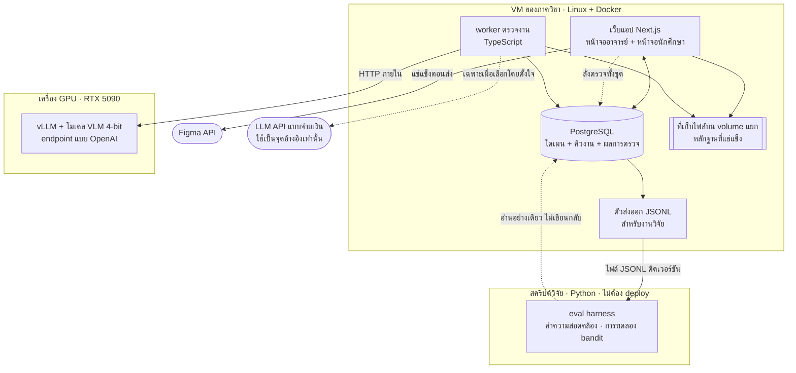
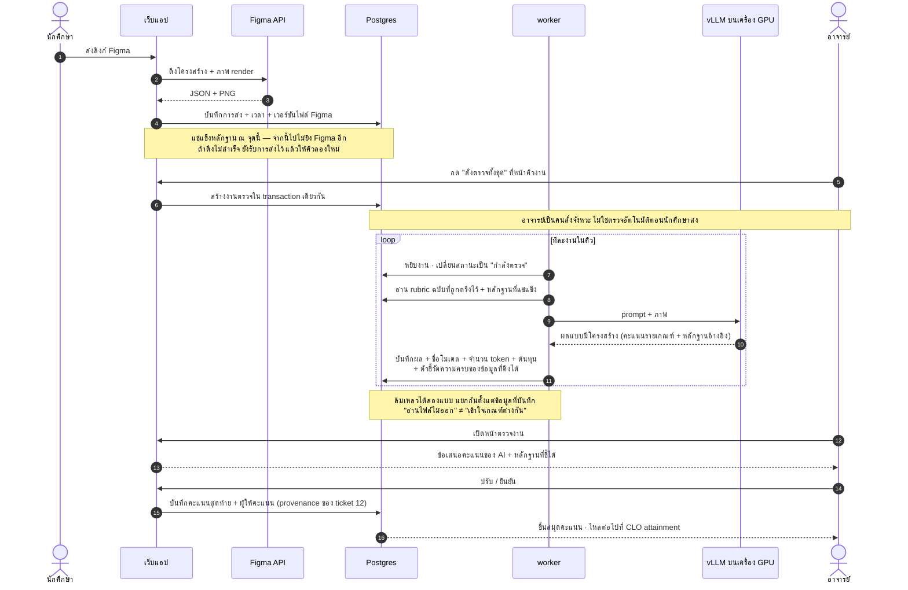

# 17 — สถาปัตยกรรมระบบและ tech stack

Type: grilling
Status: resolved (7 ส.ค. 69 — D1–D8 ครบ พร้อมของส่งมอบสามชิ้น) · ปลดล็อก ticket 23
Blocked by: 02 ✅, 06 ✅, 08 ✅ — **ปลดล็อกแล้ว 6 ส.ค. 69**

## Question

ระบบประกอบด้วยส่วนอะไรบ้าง แต่ละส่วนคุยกันอย่างไร และเลือกเทคโนโลยีอะไรให้ทีม 2-3 คนสร้างเสร็จใน 1 ปี บน infra ของคณะ?

## สิ่งที่ต้องตัดสิน

1. **รูปทรงของระบบ** — เว็บแอปก้อนเดียว (monolith) / แยก frontend กับ API / แยก service สำหรับงานตรวจต่างหาก — โดยจำได้ว่าทีมมี 2-3 คนและใช้ LLM ช่วยเขียนโค้ด คำแนะนำเริ่มต้นคือก้อนเดียวให้เรียบง่ายที่สุด แล้วแยกเฉพาะส่วนที่มีเหตุผลบังคับ
2. **การทำงานเบื้องหลัง** — การตรวจงานใช้เวลาหลายวินาทีถึงหลายนาทีต่อชิ้น และอาจต้องตรวจทั้งชั้นพร้อมกัน ต้องมีคิวงาน (job queue) แน่นอน — เลือกอะไร (Redis + worker / คิวในฐานข้อมูล / บริการสำเร็จรูป) และดูให้แน่ว่าเข้ากับข้อจำกัดของ infra จาก ticket 06
3. **ฐานข้อมูล** — เลือกอะไร และประเด็นเฉพาะที่ต้องรองรับ: การเก็บผลการตรวจแบบมีเวอร์ชัน, ข้อมูลกึ่งโครงสร้างจากผลของ LLM (JSON), การคำนวณสรุปคะแนน
4. **การเก็บไฟล์** — ไฟล์ที่ นศ. อัปโหลด (PDF/รูป) เก็บที่ไหน (ดิสก์ของเครื่อง / object storage) นโยบายขนาดไฟล์และการเก็บกี่ปี
5. **ชั้นเชื่อมต่อ LLM** — ออกแบบให้เปลี่ยนผู้ให้บริการได้โดยไม่ต้องรื้อระบบ เพราะยังไม่ล็อกงบและอาจต้องย้ายไปโมเดลในเครื่องด้วยเหตุผล PDPA; ต้องมีชั้นที่บันทึกทุก request/response ไว้เพื่อการวิจัย (เชื่อมกับ ticket 15)
6. **การเชื่อม Figma** — ตามผลของ ticket 02: เก็บ token ที่ไหน จัดการการหมดอายุอย่างไร ทำ cache ผลการดึงไฟล์ไหม (สำคัญ เพราะการตรวจซ้ำหลายรอบระหว่างพัฒนาไม่ควรยิง API ใหม่ทุกครั้ง และ **ต้องเก็บภาพ/ข้อมูลที่ดึงมา ณ เวลาที่ตรวจไว้เป็นหลักฐาน** เพราะ นศ. แก้ไฟล์ Figma ต่อได้หลังส่ง)
7. **การนำเข้าไฟล์ Excel รายชื่อ (โจทย์ข้อ 2)** — รูปแบบไฟล์ที่รองรับ, การจับคู่คอลัมน์, การจัดการแถวที่ผิดพลาด, การนำเข้าซ้ำ (อัปเดตหรือสร้างซ้ำ)
8. **การส่งออกคะแนน (โจทย์ข้อ 11)** — รูปแบบไฟล์และ template ที่คณะใช้ (อาจต้องรอข้อมูลจาก ticket 06/07)
9. **สภาพแวดล้อมการพัฒนาและการนำขึ้นระบบ** — dev/prod แยกกันอย่างไร, deploy ด้วยอะไร, ทีมนักศึกษาทำงานร่วมกันบน git อย่างไร
10. **การเลือกภาษา/เฟรมเวิร์ก** — พิจารณาจากสามข้อ: ทีมถนัดอะไร, infra คณะรองรับอะไร (ticket 06), และ ecosystem ของงาน AI — ระบุเหตุผลของทางเลือกที่ตัดทิ้งด้วย

## เพิ่มเติมจาก ticket 25 (6 ส.ค. 69)

**11. ชิ้นงานมีสองสายเท่านั้น — Figma กับ PDF — และทั้งสองสายเข้าตัวตรวจคนละทาง**

| สาย | ได้อะไรมา | หน่วยของหลักฐาน | ความเสี่ยงหลัก |
|---|---|---|---|
| **Figma** | โครงสร้างจริงจาก API (frame / layer / ชื่อ / ขนาด / สี) + ภาพ render | **พิกัดบนภาพ** | ดึงโครงสร้างได้แต่ตีความไม่ได้ว่าอะไรคือ "ปุ่ม" |
| **PDF** | หน้า + ข้อความ + ภาพต่อหน้า | **เลขหน้า + ตำแหน่งในหน้า** (หรือเลขแถวถ้าเป็นตาราง) | อ่านออกแต่ไม่รู้ว่าอันไหนคือช่องไหนของ template |

**Figma เป็นสายที่ต้องทำให้ได้ก่อน** ไม่ใช่เพราะพบบ่อยที่สุดในเทอมปัจจุบัน แต่ตรงกันข้าม — ปัจจุบันมันเป็นส่วนน้อย**เพราะตรวจด้วยมือแล้วลำบาก** ถ้าระบบทำสายนี้ได้ดี ข้อจำกัดที่กำหนดหน้าตาของรายวิชาอยู่จะถูกปลด ซึ่งเป็นคุณค่าที่ตรงที่สุดที่โครงงานนี้จะมอบให้ได้ ส่วนสาย PDF เป็นงานที่ระบบเดิมพอทำไหวอยู่แล้ว — ทำได้ก็ดี แต่ไม่ใช่จุดที่ระบบพิสูจน์ตัวเอง

**12. ต้องแยกความล้มเหลวสองแบบออกจากกันตั้งแต่ระดับสถาปัตยกรรม** (มาจาก prototype รอบ 2 ของ ticket 21)

- **"อ่านไฟล์ไม่ออก"** — analyzer ดึงข้อมูลไม่ได้/ได้ไม่ครบ → **ปรับ prompt แก้ไม่ได้เลย** ต้องแก้ที่ชั้นดึงข้อมูล
- **"เข้าใจเกณฑ์ต่างกัน"** — ข้อมูลครบแต่ตัดสินต่างจากอาจารย์ → เป็นงานของ loop ปรับจูนใน ticket 15

→ ผลต่อสถาปัตยกรรม: ชั้น analyzer ต้องคืน **ตัวชี้วัดความครบของข้อมูลที่ดึงได้** (ดึงได้กี่ frame, มีข้อความกี่บล็อก, หน้าที่อ่านไม่ออกมีไหม) แยกจากผลการตัดสิน ไม่งั้นเวลาคะแนนเพี้ยนจะแยกไม่ออกว่าต้องไปแก้ที่ไหน

## สิ่งที่ต้องได้เมื่อจบ ticket

- แผนภาพสถาปัตยกรรม (component diagram) พร้อมคำอธิบายหน้าที่ของแต่ละส่วน
- ตารางเทคโนโลยีที่เลือก พร้อมเหตุผลและทางเลือกที่ตัดทิ้ง
- ลำดับเหตุการณ์ของการตรวจงานหนึ่งชิ้นตั้งแต่ นศ. กดส่งจนคะแนนขึ้นหน้าจอ (sequence diagram)

---

## ข้อเท็จจริงและข้อกำหนดที่มาจาก ticket 06 (6 ส.ค. 69)

### รูปร่างที่ถูกบังคับแล้ว: สองเครื่อง สองชั้น

อาจารย์ยืนยันว่า **เครื่อง GPU อยู่คนละเครื่องกับ VM และใช้รันโมเดลอย่างเดียว** — สถาปัตยกรรมจึงไม่ใช่ทางเลือกอีกต่อไป:

```
[VM Linux ของกลุ่ม]                    [เครื่อง GPU · RTX 5090 32GB ×1–2]
  เว็บแอป (ฝั่งอาจารย์ + ฝั่ง นศ.)         บริการ inference
  ฐานข้อมูล                                โมเดล vision-language แบบ 4-bit
  ที่เก็บไฟล์งาน นศ.          ──เครือข่ายภายใน──▶   (ไม่มี business logic ใด ๆ)
  คิวงานตรวจ + worker
  ตัวนับต้นทุน
```

**สิ่งที่ตามมาโดยตรง:**

1. **การตรวจต้องเป็นงานคิว ไม่ใช่ request-response** — **เหตุผลคือระยะเวลาของงาน ไม่ใช่การแย่งการ์ด** (อาจารย์ยืนยัน 6 ส.ค. 69 ว่าจัดคิวใช้เครื่อง GPU กันเองได้) งานหนึ่งชิ้นมีภาพ 4–8 ภาพ โมเดล vision 27–32B บนการ์ดเดียวน่าจะใช้เวลาราว 30–60 วินาทีต่อชิ้น → ชิ้นงานหนึ่งของ 48 คน ตกราว 30–60 นาทีต่อรอบ ต่อให้การ์ดว่างทั้งเครื่องก็กดแล้วรอหน้าจอไม่ได้ → ต้องมี **job queue + worker บน VM** และหน้าจอต้องบอกสถานะ "อยู่ในคิว / กำลังตรวจ / เสร็จ" ซึ่งตรงกับหน้าจอ 09 คิวงานรอตรวจ ของ ticket 19 พอดี
   *แต่เป็นคิวแบบง่าย* — FIFO ไม่ต้องมีลำดับความสำคัญ ไม่ต้องมีการแทรกคิว และ**อาจารย์เป็นคนสั่งจังหวะเอง** ("สั่งตรวจทั้งชุดตอนนี้") ไม่ใช่ระบบตรวจอัตโนมัติทันทีที่นักศึกษาส่ง
2. **ไฟล์ต้องเดินทางข้ามเครื่อง** — ภาพจาก Figma ที่แช่แข็งไว้อยู่บน VM แต่ต้องถูกส่งไปให้โมเดลบนเครื่อง GPU ต้องตัดสินว่าใช้ shared storage หรือส่งผ่าน request และต้องคิดเรื่องขนาด (งานหนึ่งชิ้นอาจมี 4–8 ภาพความละเอียดสูง)
3. ~~ต้องกำหนดพฤติกรรมเมื่อเครื่อง GPU ไม่ว่างหรือล่ม — รอในคิว หรือ fallback ไป API ภายใต้เพดานงบ~~ **ตัดออก 6 ส.ค. 69** — อาจารย์จัดคิวใช้เครื่องกันเองได้ จึงไม่ต้องมีทาง fallback ไป API ตอนตรวจจริง งานที่รอก็แค่รออยู่ในคิว (เหลือแค่ต้องจัดการกรณีเครื่องล่มจริง ๆ: งานต้องไม่หาย และรันซ้ำได้)
4. **เครื่อง GPU ต้องไม่มี business logic** — เป็นบริการ inference ล้วน รับ prompt+ภาพ คืนผล เพื่อให้เปลี่ยนโมเดลหรือย้ายเครื่องได้โดยไม่แตะโค้ดตรวจ

### ข้อกำหนดที่มาจากเงื่อนไข "ค่า API อาจารย์ออกเอง ไม่มาก ไม่ประจำ"

5. **ชั้นนามธรรมของผู้ให้บริการโมเดล (model provider abstraction) เป็นข้อบังคับ ไม่ใช่ของแถม** — โค้ดที่ตรวจงานต้องไม่รู้ว่าโมเดลอยู่ที่ไหน สลับระหว่างโมเดลเปิดบน GPU กับ API ภายนอกต้องเป็นการเปลี่ยน config ไม่ใช่การแก้โค้ด
   *ข่าวดี:* ถ้าเลือก serving stack ที่เปิด **endpoint แบบเข้ากันได้กับ OpenAI API** (vLLM และตัวอื่นในสายเดียวกันทำได้) ข้อนี้แทบได้มาฟรี — แอปเปลี่ยนแค่ base URL กับชื่อโมเดล
6. **ทุก call ต้องบันทึกต้นทุน** — จำนวน token เข้า/ออก ผู้ให้บริการ ชื่อโมเดล และเงินที่คิดได้ ผูกกับการตรวจใบนั้น (ต่อยอดจาก provenance ของ ticket 12 ซึ่งเก็บ "ใครให้คะแนน" อยู่แล้ว — เพิ่ม "ตรวจครั้งนี้ราคาเท่าไร")
7. **ต้องมีเพดานงบที่หยุดเรียก API เองเมื่อชน** ตั้งค่าได้ที่ระดับรายวิชา (prototype หน้าจอ 02) และต้องเตือนก่อนชน ไม่ใช่หยุดเงียบ ๆ
8. **ค่าเริ่มต้นของระบบต้องเป็นโมเดลบน GPU** — ให้การเรียก API เป็นสิ่งที่ต้องเลือกโดยตั้งใจเสมอ ไม่ใช่สิ่งที่เกิดขึ้นเองเพราะลืมตั้งค่า
9. **การรัน evaluation ซ้ำต้องไม่ผูกกับ API** — ทุกครั้งที่แก้ prompt หรือ rubric ต้องรัน gold set ใหม่ทั้งชุด นี่คือส่วนที่ "ประจำ" ที่สุดของทั้งโครงงาน และเป็นเหตุผลหลักที่ GPU ต้องรับภาระนี้

### ความเสี่ยงที่ต้องปิดด้วย spike ก่อนล็อก stack

- **RTX 5090 เป็นสถาปัตยกรรม Blackwell ซึ่งใหม่** — ต้องยืนยันว่า serving stack + ไลบรารี quantization ที่เลือก รันบนการ์ดนี้ได้จริงกับ CUDA/driver เวอร์ชันที่เครื่องมี **ก่อน**เขียนโค้ดรอบตรวจ
- **ต้องยืนยันว่า VM คุยกับเครื่อง GPU ได้จริง** — อยู่ subnet เดียวกันไหม มี firewall กั้นไหม พอร์ตที่ใช้เปิดได้ไหม
- **ต้องวัดจริงว่าโมเดลเปิดตรวจงานภาพได้ดีแค่ไหน** เทียบกับ API ก่อนตัดสินว่าจะพึ่ง GPU เป็นหลักได้จริง — ถ้าห่างมากเกินไป สมการต้นทุนทั้งหมดเปลี่ยน (→ ticket 16)


---

## การตัดสินระหว่างคุย (7 ส.ค. 69)

### D1 — ภาษาและรูปทรง: TypeScript ทั้งผลิตภัณฑ์ · Python เฉพาะสคริปต์วิจัย

**ข้อเท็จจริงที่ได้จากอาจารย์:** ทีมนักศึกษาถนัด **JavaScript / TypeScript เป็นหลัก** เขียน Python พอได้แต่ไม่ใช่ทางหลัก

**ที่ตัดสิน:** เขียนผลิตภัณฑ์ทั้งหมดด้วย TypeScript — **ไม่มี Python service ในเส้นทางการตรวจ**

เหตุผลที่ทำได้: vLLM บนเครื่อง GPU เปิด endpoint **แบบเข้ากันได้กับ OpenAI API** โค้ด TS จึงเรียกโมเดลได้ตรงด้วยไลบรารีมาตรฐาน เครื่อง GPU กลายเป็น **งาน ops ไม่ใช่งานเขียนโค้ด** — ติดตั้งแล้วเหลือสภาพเป็น URL หนึ่งอันสำหรับฝั่งเว็บ

```
[VM Linux]  Next.js + Postgres + job queue + worker   ← TypeScript ทั้งหมด
               │ HTTP ภายใน (OpenAI-compatible)
[เครื่อง GPU] vLLM + โมเดล VLM 4-bit                   ← ไม่มีโค้ดของโครงงาน
```

**Python อยู่ที่เดียว: สคริปต์วิจัยออฟไลน์** — รัน gold set, คำนวณค่าความสอดคล้อง (kappa/correlation), ทดลอง contextual bandit ของ ticket 16 ไม่อยู่ในระบบที่ต้อง deploy และเป็นภาษาที่ต้องใช้ตอนเขียนเล่มอยู่แล้ว

**ผลพลอยได้ที่สำคัญ — ชุดทดลองต้องเป็นไฟล์ ไม่ใช่ฐานข้อมูล**
สคริปต์วิจัย **ห้ามต่อฐานข้อมูลของระบบโดยตรง** ให้ระบบ export gold set และผลการตรวจออกมาเป็น **JSONL ที่ติดเวอร์ชัน** แล้วสคริปต์อ่านจากไฟล์นั้น

- ตัดปัญหา "นิยามข้อมูลต้องซิงก์สองที่" ทิ้งทั้งหมด — ไม่มีการซิงก์ มีแค่การ export
- ชุดทดลองนิ่งและทำซ้ำได้ ไม่เปลี่ยนไปตามข้อมูลสดในระบบ ซึ่งเป็นข้อกำหนดของ ticket 15/16 อยู่แล้ว
- ตรงกับการแบ่งชุดพัฒนา/ชุดวัดผลของ ticket 07 §3 — ชุดวัดผลคือไฟล์ที่ล็อกไว้ ไม่ใช่ query

**ทางเลือกที่ตัดทิ้งและเหตุผล**

| ทางเลือก | เหตุผลที่ตัด |
|---|---|
| Python ทั้งระบบ (FastAPI + server-rendered) | ทีมไม่ถนัด ต้นทุนการเรียนรู้แพงกว่าที่ประหยัดได้ |
| Next.js + Python service คั่นกลาง | ไม่จำเป็น เพราะ vLLM พูด OpenAI protocol อยู่แล้ว — service คั่นกลางจะเพิ่ม deploy และจุดพังโดยไม่ให้อะไรกลับมา |
| สคริปต์วิจัยเขียนด้วย TS ให้ภาษาเดียวทั้งโครงงาน | ไลบรารีสถิติและ ML อยู่ฝั่ง Python ทั้งหมด และเป็นงานออฟไลน์ที่ไม่กระทบการ deploy จึงไม่คุ้มที่จะฝืน |

### D2 — สเปก VM ที่ต้องขอ และการตัดสินที่ตามมา

**ข้อเท็จจริงจากอาจารย์ (7 ส.ค. 69):** VM ปัจจุบัน RAM 16 GB · CPU 2 core · ดิสก์ยังไม่ระบุ — **ทั้งหมดต่อรองได้ เพราะเป็นของภาควิชาเอง**

| รายการ | ที่ควรขอ | เหตุผล |
|---|---|---|
| CPU | **4 core (8 ถ้าได้)** | งานหนักบน VM คือประมวลผลภาพ (ดึง Figma → ย่อ → แปลง) และอ่าน PDF ซึ่งกิน CPU ล้วน วิ่งต่อเนื่องเป็นชั่วโมงตอนตรวจทั้งชั้น — โมเดลไม่ได้รันที่นี่ |
| RAM | **16 GB พอ ไม่ต้องขอเพิ่ม** | Postgres + Node + worker รวมกันไม่ถึง 4 GB |
| ดิสก์ | **500 GB เป็น volume แยกจาก OS** | TABEE บังคับเก็บชิ้นงานจริงย้อนหลัง ≥2 ปีการศึกษา วงรอบรับรอง 6 ปี · 5–10 GB/เทอม/รายวิชา × 6 ปี × 2–3 วิชา ≈ 150–300 GB · volume แยกทำให้สร้าง VM ใหม่ได้โดยข้อมูลไม่หาย |
| สำรองข้อมูล | **snapshot อัตโนมัติ** | ระบบเก็บคะแนนที่เป็นหลักฐานทางการและหลักฐานที่ TABEE ต้องใช้ตอนตรวจประเมิน — เป็นเหตุผลที่ใช้ขอภาควิชาได้ตรง ๆ |

**ตัดสินตามมา:**
- **ฐานข้อมูล: PostgreSQL** — JSON แบบมีดัชนีสำหรับผลดิบจาก LLM + คำนวณสรุปคะแนนในตัว
- **คิวงาน: เก็บในตาราง Postgres ไม่ใช้ Redis** — ปริมาณงานทั้งเทอมระดับหลักพัน ไม่คุ้มที่จะเพิ่มบริการอีกตัว และการสร้างงานตรวจกับบันทึกข้อมูลอยู่ใน transaction เดียวกันได้ ทำให้งานไม่หายและไม่ซ้ำ (ตอบข้อ "เครื่องล่มแล้วงานต้องไม่หาย" ของ D1 ข้อ 3)
- **ไฟล์: ดิสก์ของ VM บน volume ที่แยก** ไม่ต้องมี object storage

### D3 — ระบบนี้เป็นของใช้จริงต่อเนื่อง ไม่ใช่ระบบสาธิต

**อาจารย์ยืนยัน 7 ส.ค. 69: "ระบบจะใช้ตรวจงานจริงต่อไป"**

งานส่งมอบให้ใช้ต่อได้จึงอยู่ในขอบเขต ราว **15–20% ของแรงทั้งโครงงาน** และต้องทำระหว่างทาง ทำย้อนหลังไม่ได้

**ข้อกำหนดที่ตามมา**

1. **migration ของฐานข้อมูลต้องเดินหน้าอัตโนมัติ** — ห้ามใช้วิธี drop-and-recreate แม้ตอนพัฒนา เพราะพอมีคะแนนจริงอยู่ในระบบแล้วจะย้อนไม่ได้ ต้องเริ่มวินัยนี้ตั้งแต่ commit แรก
2. **การติดตั้งต้องทำซ้ำได้ด้วยคำสั่งเดียว** — docker compose (VM มี docker + sudo อยู่แล้ว) และต้องมีคนอื่นที่ไม่ใช่คนเขียนลองรันสำเร็จอย่างน้อยหนึ่งครั้งก่อนจบโครงงาน
3. **การกู้คืนต้องเคยถูกทดสอบจริง** — สำรองที่ไม่เคยกู้คืนไม่นับว่าเป็นสำรอง ให้ถือเป็นรายการส่งมอบหนึ่งข้อ ไม่ใช่การตั้งค่า
4. **ความลับต้องอยู่นอก repo** — token ของ Figma, URL ของบริการโมเดล, รหัสฐานข้อมูล
5. **อาจารย์ต้องส่งออกข้อมูลทั้งหมดได้เองโดยไม่ต้องพึ่งนักศึกษา** — คะแนนเป็นหลักฐานทางการ ห้ามมีสภาพที่ข้อมูลออกมาได้ก็ต่อเมื่อมีคนเขียนโค้ดช่วย
6. **สิ่งที่ฆ่าระบบแบบนี้คือการ build ไม่ผ่าน ไม่ใช่บั๊ก** — โปรเจกต์ Node ที่ไม่มีคนดูแล 2–3 ปีจะ build ไม่ผ่านเพราะ dependency เน่า → **ต้องเก็บ image ที่ build แล้ว ไม่ใช่เก็บแค่ซอร์ส** และ pin เวอร์ชันทุกอย่างพร้อม commit lockfile

**7. หลักการเชิงสถาปัตยกรรมที่สำคัญที่สุดจากข้อนี้ — โค้ดวิจัยต้องอยู่ข้างผลิตภัณฑ์ ไม่ใช่อยู่ในเส้นทางหลัก**

ticket 04 วางแผนไว้ว่าระยะเทรนโมเดลต้องตัดทิ้งได้ทั้งหมดโดยโครงงานยังครบ และ ticket 16 วางแผนให้การทดลองล้มได้อย่างมีศักดิ์ศรี — ตอนนี้ข้อนั้นมีรูปธรรมทางสถาปัตยกรรมแล้ว:

**ถ้าการทดลอง bandit / การปรับจูนทั้งหมดถูกลบทิ้ง ระบบตรวจงานต้องยังทำงานได้เหมือนเดิม**

แปลว่า eval harness, การเก็บข้อมูลโหมด blind, การทดลองเลือกกลยุทธ์ — ทั้งหมดต้องเป็นสิ่งที่ *อ่าน* ข้อมูลจากระบบและ *เขียน* ผลไว้ข้าง ๆ ไม่ใช่สิ่งที่ระบบตรวจต้องเรียกใช้จึงจะทำงานได้ ถ้าวันหนึ่งงานวิจัยจบและไม่มีใครดูแลส่วนนั้น อาจารย์ยังตรวจงานต่อได้

**8. แยก prod ออกจาก dev ก่อนรายวิชาจริงชุดแรกเข้ามาใช้**

รันสอง stack บน VM เดียวกัน แยกฐานข้อมูลและแยก volume ขาดจากกัน (prod / staging) — ทำได้ถ้า CPU ขยับเป็น 4–8 core ตาม D2 · ทางเลือกที่สะอาดกว่าคือขอ VM ตัวที่สอง แต่แลกกับภาระดูแลสองเครื่อง จึงเลือกสอง stack บนเครื่องเดียวเป็นค่าตั้งต้น

**ตอบแล้วใน D4:** รุ่นต่อมารับช่วง

### D4 — รุ่นต่อมารับช่วง: ออกแบบเพื่อ "คนแปลกหน้าที่มีเวลาน้อย"

**อาจารย์ตอบ 7 ส.ค. 69: มีนักศึกษารุ่นต่อมารับช่วงต่อ**

ต้องพูดตรง ๆ ว่า **นี่ไม่ใช่รูปแบบการดูแลที่ง่ายที่สุด แต่เป็นแบบที่ยากที่สุด** — ทีมใหม่ทุกปี ไม่มีบริบทเดิม มีเวลาปีเดียวซึ่งส่วนใหญ่หมดไปกับงานวิจัยของตัวเอง และการส่งมอบเกิดขึ้นตามปฏิทิน ไม่ใช่ตามความพร้อม

**โหมดความล้มเหลวที่ต้องกันไว้ตั้งแต่ต้น: รุ่นต่อไปตัดสินใจเขียนใหม่แทนที่จะอ่านของเดิม** เพราะการอ่านโค้ดคนอื่นยากกว่าการเขียนใหม่เสมอ ถ้าปล่อยให้เกิด ระบบจะกลับไปที่ศูนย์ทุกปีและไม่มีวันโตพอจะใช้จริง

**เกณฑ์ออกแบบที่เปลี่ยนไปจากข้อนี้ — เป้าหมายคือ "คนแปลกหน้าอ่านเข้าใจ" ไม่ใช่ "สวย" หรือ "ฉลาด"**

1. **เลือกของกระแสหลักเท่านั้น ห้ามฉลาด** — ทุกไลบรารีแปลก ๆ และทุกนามธรรมที่คิดขึ้นเอง คือภาษีที่รุ่นต่อไปต้องจ่าย · เพิ่มเติมที่สำคัญในยุคนี้: **รุ่นต่อไปจะใช้ AI ช่วยอ่านโค้ด** ของกระแสหลักจึงได้ความช่วยเหลือที่ดีกว่ามาก ข้อนี้เป็นเหตุผลทางเทคนิคจริง ไม่ใช่รสนิยม
2. **ฐานข้อมูลคือสินทรัพย์ที่อายุยาวที่สุด ไม่ใช่โค้ด** — โค้ดจะถูกเขียนใหม่โดยรุ่นใดรุ่นหนึ่งแน่นอน แต่ข้อมูลคะแนนย้อนหลังเขียนใหม่ไม่ได้ → **ลงแรงกับการออกแบบ schema และ migration มากกว่าปกติ** และถือว่าเป็นส่วนที่ห้ามรื้อโดยไม่มีเหตุผลหนัก
3. **เอกสารที่รอดคือเอกสารที่รันได้** — prose doc เน่าภายในหนึ่งเทอม สิ่งที่ควรส่งมอบแทนคือ **สคริปต์ติดตั้งที่รันผ่าน + seed script ที่สร้างข้อมูลตัวอย่างใช้งานได้จริง + เทสต์ที่อธิบายพฤติกรรม** รุ่นต่อไปเรียนรู้จากการรัน ไม่ใช่จากการอ่าน
4. **บันทึกเหตุผลคือของส่งมอบ** — แผนที่ wayfinder และตั๋วทั้ง 27 ใบนี้ **คือเอกสารส่งมอบให้รุ่นต่อไป** ไม่ใช่ของใช้แล้วทิ้งของรุ่นนี้ เพราะสิ่งที่รุ่นต่อไปขาดที่สุดคือ "ทำไมถึงทำแบบนี้" ไม่ใช่ "มันทำงานยังไง"
5. **ซ้อมการส่งมอบจริง** — งานชิ้นสุดท้ายของรุ่นนี้คือนั่งดูรุ่นต่อไปติดตั้งระบบขึ้นมาใหม่จากศูนย์ให้สำเร็จ
6. **ระบบที่รันอยู่ต้องสาวกลับไปหา git tag ได้เสมอ** — ห้าม deploy จาก branch ที่กำลังทำงานอยู่

**ผลต่อรอยต่อ product ↔ research (ต่อจาก D3 ข้อ 7)**
รูปแบบที่จะเกิดขึ้นจริงคือ **ผลิตภัณฑ์สะสมขึ้นเรื่อย ๆ ส่วนงานทดลองเข้ามาแล้วก็จากไปทุกรุ่น** รอยต่อนี้จึงไม่ใช่แค่ "ลบงานวิจัยแล้วระบบต้องรอด" แต่คือ **แต่ละรุ่นต้องเอาการทดลองของตัวเองมาต่อข้าง ๆ ผลิตภัณฑ์ที่นิ่งได้ โดยไม่ต้องแก้ผลิตภัณฑ์** ถ้าทำข้อนี้ไม่สำเร็จ ทุกรุ่นจะต้องรื้อของเดิม

**กลยุทธ์ป้องกันการเขียนใหม่ที่ได้ผลที่สุด: เอาระบบเข้าใช้งานจริงให้เร็วที่สุด**
ระบบที่มีคะแนนจริงของเทอมนี้อยู่ข้างในนั้นรื้อทิ้งไม่ได้ง่าย ๆ — การมีผู้ใช้จริงคือเกราะป้องกันที่แข็งแรงกว่าเอกสารหรือเทสต์ใด ๆ → **ผลต่อ ticket 23 (ขอบเขต MVP): MVP ควรเล็กและเข้าใช้จริงเร็ว มากกว่าครบและเข้าใช้ช้า**

### D5 — อาจารย์ดูแลโครงสร้างเองตั้งแต่แรก

**อาจารย์ระบุ 7 ส.ค. 69: "จะเข้าไปช่วยดูแลโครงสร้างตั้งแต่แรก"**

เปลี่ยนความเสี่ยงของ D4 ไปมาก เพราะมี **ผู้ถือบริบทที่อยู่ต่อเนื่อง** ข้ามรุ่น

**สิ่งที่แก้ได้จริง**
- ความเสี่ยง "รุ่นต่อไปเขียนใหม่" ลดลงมาก เพราะมีคนที่ปฏิเสธได้และรู้ว่าทำไมของเดิมเป็นแบบนั้น
- ภาระเอกสาร onboarding เบาลง — ความรู้ "ทำไม" ไม่ต้องฝากไว้กับเอกสารอย่างเดียว และอาจารย์เป็นผู้ร่วมตัดสินใจในแผนที่ wayfinder นี้เองอยู่แล้ว → **ประหยัดเวลานักศึกษาไปได้จริง ใช้เวลานั้นกับ seed script และเทสต์แทน ซึ่งมีค่ากว่า**

**สิ่งที่ยังไม่แก้ — ต้องไม่เข้าใจผิด**
- **อาจารย์กลายเป็นจุดเดียวที่ระบบพึ่งพา และเวลาของอาจารย์คือทรัพยากรที่หายากที่สุดในโครงงาน** ทุกการออกแบบที่ต้องให้อาจารย์เข้าไปแก้ คือภาษีที่เก็บจากคนที่มีเวลาน้อยที่สุด
- **"ดูแลโครงสร้าง" ไม่เท่ากับ "แก้บั๊กตอนห้าทุ่มก่อนกำหนดส่งคะแนน"** อาจารย์ถือความต่อเนื่องเชิงสถาปัตยกรรม ไม่ใช่ความพร้อมเชิงปฏิบัติการ → ข้อกำหนดด้านปฏิบัติการใน D3 (ติดตั้งคำสั่งเดียว · กู้คืนที่เคยทดสอบจริง · เก็บ image ที่ build แล้ว) **ยังต้องทำครบทุกข้อ ไม่มีข้อไหนถูกลดหย่อน**

**สิ่งที่ควรเพิ่มเข้ามาเพราะข้อนี้ — ประตูตรวจที่แคบที่สุดที่ได้ผลมากที่สุด**

ไม่ใช่ให้อาจารย์รีวิวโค้ดทั้งหมด (แพงเกินไปและจะเลิกทำภายในเดือนเดียว) แต่ตรวจเฉพาะ **สองอย่างที่ย้อนกลับไม่ได้**:

1. **การเปลี่ยน schema ของฐานข้อมูล** — เพราะข้อมูลคะแนนย้อนหลังเขียนใหม่ไม่ได้ (D4 ข้อ 2)
2. **การเพิ่ม dependency ตัวใหม่** — เพราะเป็นทางที่ระบบสะสมของแปลกจนรุ่นต่อไปอ่านไม่ออก (D4 ข้อ 1)

โค้ดที่เหลือรื้อได้เสมอ สองอย่างนี้รื้อไม่ได้ · **ข้อดีที่บังเอิญพอดี: ทั้งสองอย่างอ่านได้โดยแทบไม่ขึ้นกับภาษาที่ใช้เขียน** — schema คือ SQL และ dependency คือรายชื่อ อาจารย์จึงตรวจได้แม้ไม่ได้เขียน TypeScript เอง

**ตอบแล้ว 7 ส.ค. 69:** อาจารย์อ่าน TypeScript ได้ พอเขียนได้บ้าง → **D1 ยืนตามเดิม ไม่ต้องทบทวน** ระดับนี้เพียงพอสำหรับการชี้ว่าอะไรผิดทิศ ซึ่งเป็นงานของผู้กำกับโครงสร้าง ไม่ใช่งานของคนเขียน

### D6 — นำเข้ารายชื่อจาก Excel (โจทย์ข้อ 2)

นโยบายตัดสินไว้แล้วที่ ticket 19: **บังคับขั้นตรวจก่อนยืนยัน และเป็น add-only — ระบบห้ามถอนนักศึกษาออกเอง** ที่เหลือคือรูปธรรม

- **รับ .xlsx และ .csv · ไม่มี template ตายตัว** — อ่านแถวหัวตาราง แล้วให้อาจารย์จับคู่คอลัมน์เอง (รหัสนักศึกษา · ชื่อ · อีเมล) ระบบ**จำการจับคู่ไว้ต่อรายวิชา** เพื่อให้การนำเข้าครั้งถัดไปไม่ต้องทำซ้ำ — สำคัญเพราะไฟล์จากทะเบียนเปลี่ยนรูปแบบได้ตามปี และการบังคับ template จะทำให้ระบบพังทุกครั้งที่คณะเปลี่ยนแบบฟอร์ม
- **รหัสนักศึกษาเป็นกุญแจของตัวตน** — จับคู่ด้วยรหัสเสมอ ไม่ใช่ชื่อ
- **หน้าตรวจก่อนยืนยันแสดงสามกอง**: เพิ่มใหม่กี่คน · มีอยู่แล้วกี่คน (ไม่ทำอะไร) · แถวที่มีปัญหากี่แถว พร้อมเลขแถวในไฟล์
- **แถวที่มีปัญหาไม่ซ่อมให้อัตโนมัติ** — รหัสซ้ำในไฟล์ · ไม่มีรหัส · รูปแบบรหัสไม่ตรง → บอกเลขแถว ให้อาจารย์แก้ในไฟล์แล้วอัปโหลดใหม่ การเดาแทนผู้ใช้ในข้อมูลที่ผูกกับคะแนนมีราคาแพงกว่าการให้แก้เอง
- **นำเข้าซ้ำต้องได้ผลเท่าเดิม** (idempotent) — แถวที่มีอยู่แล้วไม่สร้างซ้ำ ไม่แก้ทับ
- **เก็บไฟล์ต้นฉบับที่อัปโหลดไว้ด้วย** — ราคาถูกมาก และตอบได้เสมอว่ารายชื่อชุดนี้มาจากไหนเมื่อไร ซึ่งเป็นเรื่องเดียวกับ provenance ของ ticket 12
- **ข้อควรระวังที่จะเจอจริงแน่ ๆ: การเข้ารหัสอักขระ** — ไฟล์ CSV ที่ออกจากระบบทะเบียนไทยมักเป็น TIS-620 / Windows-874 ไม่ใช่ UTF-8 ถ้าอ่านแบบ UTF-8 ตรง ๆ ชื่อไทยจะกลายเป็นขยะทั้งไฟล์ → ต้องตรวจจับการเข้ารหัสและให้ผู้ใช้เห็นตัวอย่างข้อความในหน้าตรวจก่อนยืนยัน จะได้เห็นทันทีว่าอ่านถูกไหม

### D7 — การเชื่อม Figma: แช่แข็งตอนส่ง แล้วไม่ดึงซ้ำอีกเลย

**กฎข้อเดียวที่ตอบทั้งเรื่องหลักฐานและเรื่อง cache พร้อมกัน:**

> ดึงจาก Figma **ครั้งเดียว ณ เวลาที่นักศึกษากดส่ง** เก็บไว้เป็นหลักฐานถาวร — **การตรวจทุกครั้งหลังจากนั้นใช้สำเนาที่แช่แข็งไว้เสมอ ไม่ยิง Figma API ใหม่**

- แก้ปัญหาที่นักศึกษาแก้ไฟล์ Figma ต่อได้หลังส่ง (ticket 17 ข้อ 6 เดิม) — สิ่งที่ถูกตรวจคือสิ่งที่ส่ง
- แก้ปัญหาการตรวจซ้ำหลายรอบระหว่างพัฒนาไปพร้อมกัน โดยไม่ต้องมีชั้น cache แยก
- ทำให้การรัน gold set ซ้ำ ๆ ของ ticket 15/16 ทำซ้ำได้จริง เพราะข้อมูลนำเข้าไม่เปลี่ยน

**สิ่งที่ต้องเก็บตอนแช่แข็ง:** ภาพ render ทุกเฟรมที่เกี่ยวข้อง · โครงสร้างไฟล์ที่ดึงมา (JSON) · **หมายเลขเวอร์ชันของไฟล์ Figma** · เวลาที่ดึง — สี่อย่างนี้ทำให้ตอบได้เสมอว่าตรวจจากอะไร

**การเข้าถึงไฟล์:** ใช้ **บัญชีบริการหนึ่งบัญชีของระบบ + นักศึกษาต้องแชร์ไฟล์มาที่บัญชีนั้น** เก็บ token เป็นความลับนอก repo (D3 ข้อ 4) และเขียนขั้นตอนต่ออายุไว้ในเอกสารส่งมอบ
*ทางเลือกที่ตัด:* ให้นักศึกษาแต่ละคน OAuth เข้ามา — ถูกต้องกว่าในเชิงสิทธิ์ แต่เพิ่มงานมากและเพิ่มจุดพังตอนส่งงานนาทีสุดท้าย ไม่คุ้มกับ MVP

**ถ้าดึงไม่สำเร็จตอนส่ง ห้ามทำให้การส่งงานล้มเหลว** — รับการส่งไว้ก่อน ทำเครื่องหมายว่า "ยังไม่ได้เก็บหลักฐาน" แล้วให้คิวงานลองใหม่ พร้อมแจ้งนักศึกษาว่าต้องตรวจสอบสิทธิ์การแชร์ · นักศึกษาต้องไม่เสียคะแนนเพราะ API ของบุคคลที่สามล่มในนาทีสุดท้าย

---

## ของส่งมอบของตั๋ว

### 1. แผนภาพองค์ประกอบ



**หลักการอ่านแผนภาพนี้:** ลูกศรจาก `EVAL` เป็นเส้นประและอ่านอย่างเดียวเสมอ — ถ้าลบกล่อง `OFFLINE` ทิ้งทั้งกล่อง ระบบตรวจงานยังทำงานครบ (D3 ข้อ 7, D4)

### 2. ตารางเทคโนโลยี

| ส่วน | เลือก | เหตุผล | ที่ตัดทิ้ง |
|---|---|---|---|
| เว็บ | **Next.js (TypeScript)** | ทีมถนัด · กระแสหลัก · AI ช่วยอ่านได้ดี (D4 ข้อ 1) | Django/FastAPI + server-rendered — ทีมไม่ถนัด |
| ฐานข้อมูล | **PostgreSQL** | JSON มีดัชนีสำหรับผลดิบ LLM · คำนวณสรุปคะแนนในตัว · เป็นสินทรัพย์อายุยาวที่สุด (D4 ข้อ 2) | MongoDB — โดเมนนี้เป็นความสัมพันธ์ล้วน · SQLite — หลายกระบวนการเขียนพร้อมกัน |
| คิวงาน | **ตารางใน Postgres** | ปริมาณระดับหลักพันต่อเทอม · สร้างงานตรวจกับบันทึกข้อมูลอยู่ใน transaction เดียวกัน งานไม่หายไม่ซ้ำ | Redis/BullMQ — บริการเพิ่มอีกตัวที่ต้องดูแลโดยไม่ได้อะไรกลับมาที่ปริมาณนี้ |
| ไฟล์ | **ดิสก์บน volume แยก** | ปริมาณคาดการณ์ 150–300 GB ใน 6 ปี · สร้าง VM ใหม่ได้โดยข้อมูลไม่หาย | object storage — ไม่มีของในภาควิชา เพิ่มความซับซ้อนโดยเปล่าประโยชน์ |
| โมเดล | **vLLM บนเครื่อง GPU · endpoint แบบ OpenAI** | ทำให้สลับ local ↔ API เป็นการเปลี่ยน config · ตัด Python ออกจากเส้นทางการตรวจ | รันโมเดลบน VM — ไม่มี GPU · เรียก API เป็นหลัก — ขัดข้อจำกัดค่าใช้จ่าย |
| นำขึ้นระบบ | **Docker Compose สอง stack (prod/staging)** | VM มี docker + sudo อยู่แล้ว · แยกข้อมูลจริงออกจากที่นักศึกษากำลังพัง | Kubernetes — เกินความจำเป็นมหาศาลสำหรับสองเครื่อง |
| สคริปต์วิจัย | **Python อ่านจาก JSONL** | ไลบรารีสถิติอยู่ฝั่งนี้ · เป็นงานออฟไลน์ ไม่กระทบการ deploy | เขียนด้วย TS ให้ภาษาเดียว — ฝืนโดยไม่ได้ประโยชน์ |

### 3. ลำดับเหตุการณ์ของการตรวจงานหนึ่งชิ้น



---

## D8 — การส่งออกคะแนน (โจทย์ข้อ 11)

**อาจารย์ตอบ 7 ส.ค. 69:** คณะมีทั้งอัปโหลด Excel ตาม template และป้อนลงเว็บ **แต่ไม่เป็นประเด็น** — ขอแค่ **รหัสนักศึกษา · ชื่อนักศึกษา · คะแนน** และอาจารย์ copy-paste ระหว่างชีตเอาได้

**ผลที่ตามมาคือไม่ต้องรองรับ template ของคณะเลย** ซึ่งเป็นงานจุกจิกที่จะพังทุกครั้งที่คณะเปลี่ยนแบบฟอร์ม — ตรงกับหลักของ D4 ที่ว่าอย่าผูกกับสิ่งที่คนอื่นเปลี่ยนได้ และตรงกับข้อสรุปของ ticket 05 ที่ว่าให้ **ส่งออกข้อมูล ไม่ใช่ส่งออกแบบฟอร์ม**

### ความเสี่ยงที่ต้องออกแบบกัน: การวางผิดแถวแบบเงียบ ๆ

ถ้าอาจารย์คัดลอกเฉพาะคอลัมน์คะแนนไปวางในชีตของทะเบียน แล้วลำดับแถวสองฝั่งไม่ตรงกัน **คะแนนจะไปลงผิดคนโดยไม่มีสัญญาณเตือนใด ๆ** และตรวจไม่พบจนกว่านักศึกษาจะทักท้วง เป็นความผิดพลาดที่ระบบต้องกัน ไม่ใช่ฝากไว้กับความระมัดระวังของคน

**ข้อกำหนด**

1. **เรียงตามรหัสนักศึกษาจากน้อยไปมากเป็นค่าตั้งต้นเสมอ** — ลำดับเดียวกับที่ระบบทะเบียนใช้ ทำให้การวางตรงกันโดยธรรมชาติ
2. **ส่งออกสามคอลัมน์ติดกันเสมอ: รหัส · ชื่อ · คะแนน — ไม่มีโหมดส่งออกคะแนนอย่างเดียว** การบังคับให้รหัสกับชื่อเดินทางไปด้วยคือสิ่งที่ทำให้อาจารย์เห็นด้วยตาว่าวางตรงคน
3. **ไม่มีเซลล์ผสาน ไม่มีแถวว่าง ไม่มีหัวตารางหลายชั้น** หนึ่งแถวต่อหนึ่งคน
4. **จำนวนตำแหน่งทศนิยมตั้งค่าได้ที่รายวิชา** และปัดเศษตอนส่งออก ไม่ใช่ปัดตอนคำนวณ — ค่าตั้งต้น 2 ตำแหน่ง
5. รองรับ .xlsx และ .csv (CSV เป็น UTF-8 with BOM เพื่อให้ Excel บนวินโดวส์เปิดภาษาไทยไม่เพี้ยน — คู่กับปัญหาการเข้ารหัสใน D6)

### ผลต่อ ticket 19 — ช่องทางส่งออกหลักไม่ใช่ไฟล์

ถ้าวิธีทำงานจริงของอาจารย์คือ copy-paste แปลว่า **การคัดลอกจากหน้าจอคือช่องทางหลัก การดาวน์โหลดไฟล์เป็นช่องทางรอง**

→ **หน้าสมุดคะแนน (หน้าจอ 10) ต้องเลือกช่วงแล้วคัดลอกได้ตรงจากหน้าจอ** พร้อมปุ่ม "คัดลอกสามคอลัมน์สำหรับส่งทะเบียน" ที่จัดลำดับและรูปแบบให้เรียบร้อยแล้ว — ไม่ใช่ให้อาจารย์ดาวน์โหลดไฟล์แล้วเปิด Excel ก่อนทุกครั้ง

---

## ข้อกำหนดย้อนกลับจาก ticket 20 (7 ส.ค. 69)

อาจารย์ยอมให้นักศึกษาส่งใหม่ได้แม้เลยกำหนด โดยแลกกับค่าปรับ และปิดรับเมื่ออาจารย์กด **สั่งตรวจทั้งชุด**

→ เหตุการณ์ **สั่งตรวจทั้งชุด** ในผังลำดับของตั๋วนี้ **ทำสองอย่างพร้อมกัน ไม่ใช่อย่างเดียว**

1. สร้างงานเข้าคิวในทรานแซกชันเดียวกัน (ตามที่วาดไว้แล้ว)
2. **ล็อกการส่งของกิจกรรมการประเมินนั้นทั้งชุด** — ต้องอยู่ในทรานแซกชันเดียวกัน ไม่งั้นเกิดช่องที่นักศึกษาส่งใหม่ได้พอดีระหว่างสองคำสั่ง แล้วหลักฐานที่ถูกตรวจกับหลักฐานล่าสุดไม่ตรงกัน

ต้องเพิ่มในโมเดลข้อมูล: สถานะการล็อกที่ระดับ **กิจกรรมการประเมิน** และช่องปลดล็อกเป็นรายคน (อาจารย์รับเรื่องจากนักศึกษาที่มาคุยด้วยตัวเอง)
